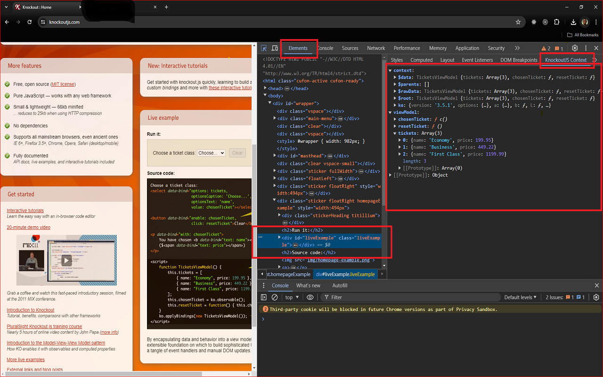

# KnockoutJS Scanner

A Chrome DevTools extension designed to help developers debug and inspect Knockout.js applications more effectively.

## Features

### Live Viewing of Knockout.js ViewModel Data and Context

The extension enables live viewing of Knockout.js view model data and context directly in the Chrome DevTools. 

Once you select an element in the Elements Panel of DevTools, you can view the data and context associated with it in a sidebar pane titled "KnockoutJS Context".
This can be extremely helpful for debugging and provides real-time insights into your Knockout.js application as you interact with it in the browser.

### KnockoutJS Editor Panel

The extension also provides a dedicated panel for viewing and interacting with Knockout.js observables. This panel allows you to:
- View all observables associated with the selected DOM element
- See the type of each observable (observable, observableArray, or computed)
- View the current value of each observable

## Installation

### From Chrome Web Store

1. Visit the [Chrome Web Store](https://chrome.google.com/webstore/category/extensions) (link to be updated when published)
2. Search for "KnockoutJS Scanner"
3. Click "Add to Chrome"

### Manual Installation (Developer Mode)

1. Clone this repository:
   ```
   git clone https://github.com/yourusername/ko-scanner.git
   ```

2. Build the extension:
   ```
   cd ko-scanner
   npm install
   npm run build
   ```

3. Open Chrome and navigate to `chrome://extensions/`

4. Enable "Developer mode" by toggling the switch in the top-right corner

5. Click "Load unpacked" and select the `dist` directory from the cloned repository

## Usage

### Viewing Knockout.js Context

1. Open Chrome DevTools (F12 or Right-click > Inspect)
2. Navigate to the Elements panel
3. Select any DOM element that has Knockout.js bindings
4. Look for the "KnockoutJS Context" sidebar pane (you may need to click the >> icon to find it)
5. The sidebar will display the Knockout.js data and context associated with the selected element

### Using the KnockoutJS Editor Panel

1. Open Chrome DevTools (F12 or Right-click > Inspect)
2. Click on the "KnockoutJS Editor" tab in the DevTools
3. Select any DOM element with Knockout.js bindings in the Elements panel
4. The panel will display all observables associated with the selected element

## Screenshots

### KnockoutJS Context Sidebar



### KnockoutJS Editor Panel

<!-- TODO: Add actual screenshot of the KnockoutJS Editor Panel -->
 <!-- Temporary placeholder, replace with actual editor panel screenshot -->

## Requirements

- Google Chrome browser
- A web application that uses Knockout.js for data binding

## Documentation

For more detailed information, please refer to the following documentation:

- [User Guide](docs/USER_GUIDE.md) - Detailed instructions on how to use the extension
- [Developer Documentation](docs/DEVELOPERS.md) - Information for developers who want to contribute

## License

This project is licensed under the ISC License - see the LICENSE file for details.

## Acknowledgments

- [Knockout.js](https://knockoutjs.com/) - The JavaScript library this extension is designed to work with
